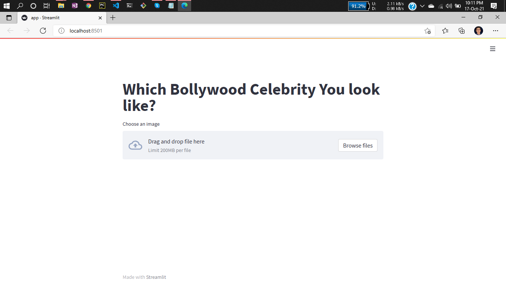
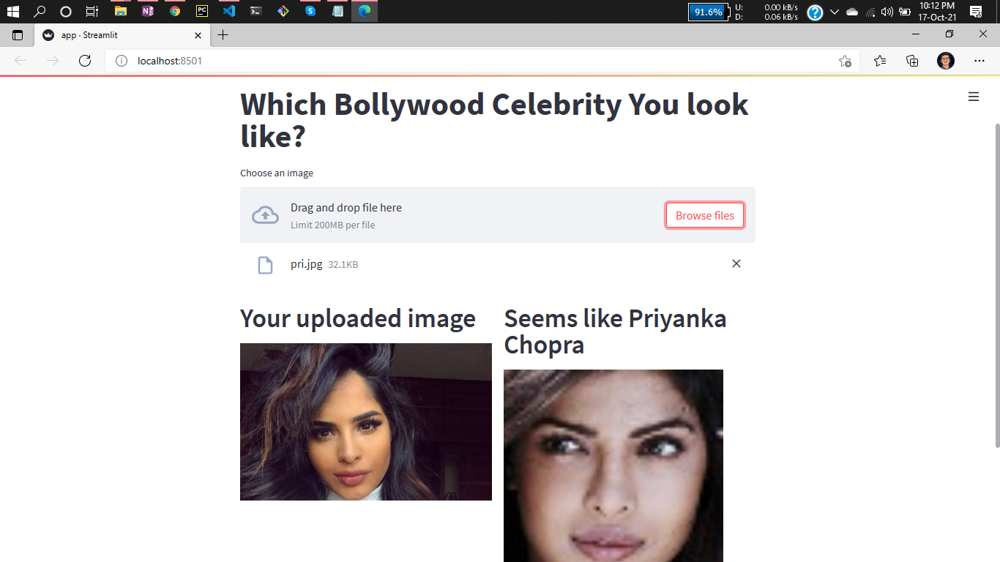
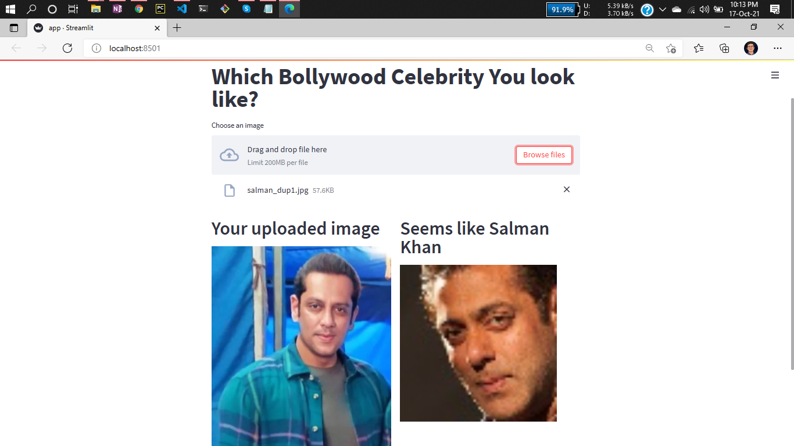
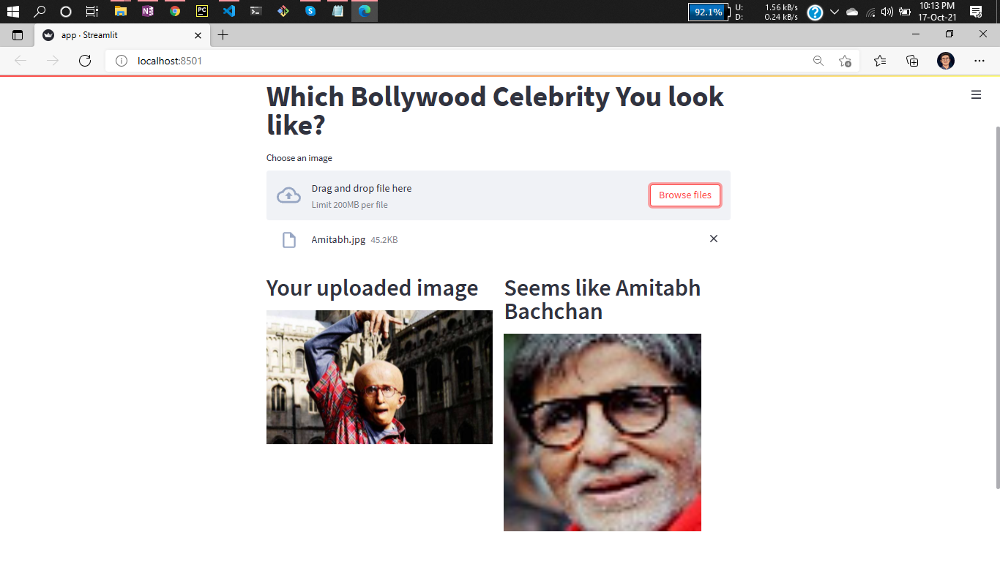
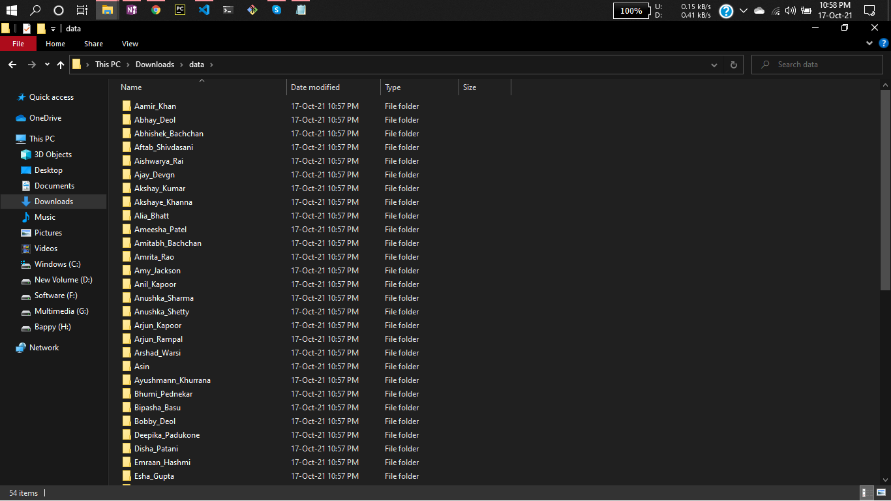

# Project Name: Face Matching Web Application | VGG16, Streamlit, Python 

Introducing a Streamlit web application based on deep learning that can determine which Bollywood celebrity your face resembles. Face recognition involves the task of identifying and verifying individuals in photographs based on their facial features. While humans can effortlessly perform this task despite challenges such as varying lighting conditions, age-related changes, and facial obstructions like accessories and facial hair, it has remained a complex problem in computer vision for many years.

However, recent advancements in deep learning have revolutionized face recognition. By harnessing vast datasets of faces and learning intricate and compact face representations, modern deep learning models can now match or even surpass human-level performance in face recognition.

This project aims to explore the face recognition problem and demonstrate how deep learning techniques can achieve superhuman capabilities in identifying similar faces. The methodology involves analyzing various aspects of facial characteristics in pictures, including face shape, nose, eyes, and mouth. Additionally, it considers the face's position within the image, skin color (accounting for lighting conditions), hair color, and uses techniques like cosine similarity to determine facial similarities.

By leveraging deep learning algorithms and these comprehensive analysis techniques, the streamlit web app can provide insights into which Bollywood celebrity shares a resemblance with your face.

# Dataset:
https://www.kaggle.com/sushilyadav1998/bollywood-celeb-localized-face-dataset


# Demo:

Web app look



Lets check some of images





This really performing good you can consider by seeing this result 😀



# STEPS to run this project:

You can also use others images instead of bollywood actress

## STEP 01: 
Clone the repository

```bash
git clone https://github.com/raj-maharajwala/Face-Matching-Web-Application-VGG16.git
```

## STEP 02: 
Create an environment


```bash
conda create -n celebrity python=3.7 -y
```

## STEP 03: 
Install the requirements


```bash
pip install -r requirements.txt
```

## STEP 04: 
Download the data from the link and keep it in your project directory. Make sure all the actress folder should be in just one folder called data, like that



## STEP 05: 
Just execute this command one time if you are not changing the data


```bash
python run.py
```

## STEP 06: 
Now to start the webapp run the following command


```bash
streamlit run app.py
```

Certainly! You are now able to commence making predictions :)

# Authors:
```bash
Author: Raj Maharajwala
Data Scientist
Email: maharajw@usc.edu
```


